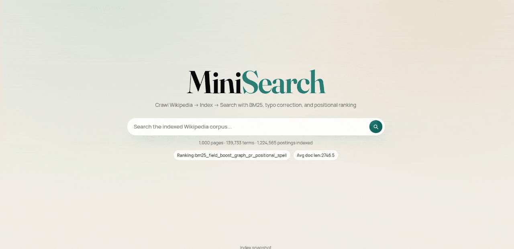

# MiniSearch Engine

MiniSearch Engine is a full-stack web search system built with Python, MySQL, Node.js, and a browser UI. It crawls a corpus, builds a BM25 inverted index, computes PageRank from the link graph, and serves ranked results with typo correction, autocomplete, and result highlighting.

This repository is designed like a production deliverable rather than a classroom demo:

- Persistent MySQL schema for pages, crawl history, postings, PageRank, and index metadata
- Deterministic reindexing pipeline
- Spell correction and prefix suggestions backed by an in-memory lexicon
- Health and metrics endpoints for operational visibility
- Automated tests for the search utilities, crawler helpers, and tokenizer logic




## Architecture

```text
scripts/python/crawler.py   ->  MySQL pages + crawl_log + crawl_edges
scripts/python/indexer.py   ->  MySQL terms + postings + page_rank + index_meta
backend/server.js           ->  Express API + static UI
public/index.html           ->  Search interface
```

The search API combines multiple signals at query time:

- BM25 relevance from title and body term frequency
- Title boosting
- PageRank from the crawl graph
- Coverage scoring for multi-term queries
- Phrase and proximity signals
- Spell correction and autocomplete support

## Stack

- Python 3.10+
- Node.js 18+
- MySQL 8+
- Express for the API
- Vanilla HTML, CSS, and JavaScript for the UI

## Repository Layout

```text
backend/        Express API and shared search helpers
public/         Browser UI
scripts/python/  Crawler, indexer, and MySQL connection helpers
scripts/         End-to-end pipeline script
tests/          JavaScript and Python tests
```

## Getting Started

### 1. Create the database

```sql
CREATE DATABASE search_engine CHARACTER SET utf8mb4 COLLATE utf8mb4_unicode_ci;
CREATE USER 'mini_search'@'localhost' IDENTIFIED BY 'change_me';
GRANT ALL PRIVILEGES ON search_engine.* TO 'mini_search'@'localhost';
FLUSH PRIVILEGES;
```

### 2. Configure environment variables

```bash
cp .env.example .env
```

Example `.env`:

```env
MYSQL_HOST=127.0.0.1
MYSQL_PORT=3306
MYSQL_USER=mini_search
MYSQL_PASSWORD=change_me
MYSQL_DATABASE=search_engine
PORT=3001
```

### 3. Install dependencies

```bash
python3 -m venv .venv
source .venv/bin/activate
pip install -r requirements.txt
npm install
```

## Run the System

### Option A: Step by step

```bash
python3 scripts/python/crawler.py --seed https://en.wikipedia.org/wiki/Main_Page --max 120 --fresh
python3 scripts/python/indexer.py
node backend/server.js
```

Open `http://localhost:3001/index.html`.

### Option B: End-to-end pipeline

```bash
npm run pipeline -- https://en.wikipedia.org/wiki/Main_Page 120
```

The pipeline script:

1. Crawls the seed URL
2. Rebuilds the BM25/PageRank index
3. Starts the API and UI server

By default it uses `--fresh` so switching corpora does not mix old content with the new crawl.

## Search Experience

The UI exposes:

- Ranked search results with highlighted snippets
- Search suggestions while typing
- Typo correction for near-miss queries
- Recent query history in local storage
- Live corpus stats and runtime metrics

Example request:

```bash
curl "http://localhost:3001/search?q=information%20retrieval&page=1&limit=5"
```

Example response includes:

- `results` with score breakdowns
- `diagnostics` with the active ranking strategy and parameters
- `matched_terms`, `unmatched_terms`, and correction details
- Pagination metadata

## API Endpoints

- `GET /search?q=<query>&page=1&limit=10`
- `GET /suggest?q=<prefix>`
- `GET /stats`
- `GET /metrics`
- `GET /health`

## Ranking Model

MiniSearch is intentionally hybrid. It does not rely on a single signal.

1. Query terms are tokenized and stopwords are removed.
2. Each page is scored with BM25 using separate title and body term frequency.
3. Title matches receive a configurable boost.
4. PageRank contributes authority derived from the crawl graph.
5. Coverage, phrase, and proximity signals improve ranking for multi-term queries.
6. If a query looks misspelled, the lexicon suggests a correction before ranking.

The current ranking parameters are stored in `index_meta` so the API can expose them without hardcoding values in the frontend.

## Reindexing Behavior

- `scripts/python/indexer.py` drops and rebuilds the search tables on each run.
- `pages` and crawl logs remain intact, so you can re-run the crawler and rebuild the index without losing history.
- `index_meta` stores the current tuning values, corpus size, and the active ranking strategy.

## Testing

```bash
npm test
```

This runs:

- `tests/search_utils.test.js`
- `tests/test_indexer_tokenizer.py`
- `tests/test_crawler_helpers.py`

## Troubleshooting

- If `npm test` cannot find Python, make sure `python3` is installed and available on your `PATH`.
- If the server exits on startup, confirm that `.env` exists and that MySQL credentials are valid.
- If crawl results look stale, rerun the crawler with `--fresh` before reindexing.

## Why This Project Stands Out

- It combines crawling, indexing, ranking, and serving into one coherent system.
- It shows practical search engineering: BM25, PageRank, typo correction, snippets, and autocomplete.
- It includes an operational story with health checks, metrics, and deterministic rebuilds.
- It is documented and tested, which makes it easier to evaluate and maintain.

## Files Worth Reviewing

- `scripts/python/crawler.py`
- `scripts/python/indexer.py`
- `backend/server.js`
- `backend/search_utils.js`
- `public/script.js`
- `public/style.css`
